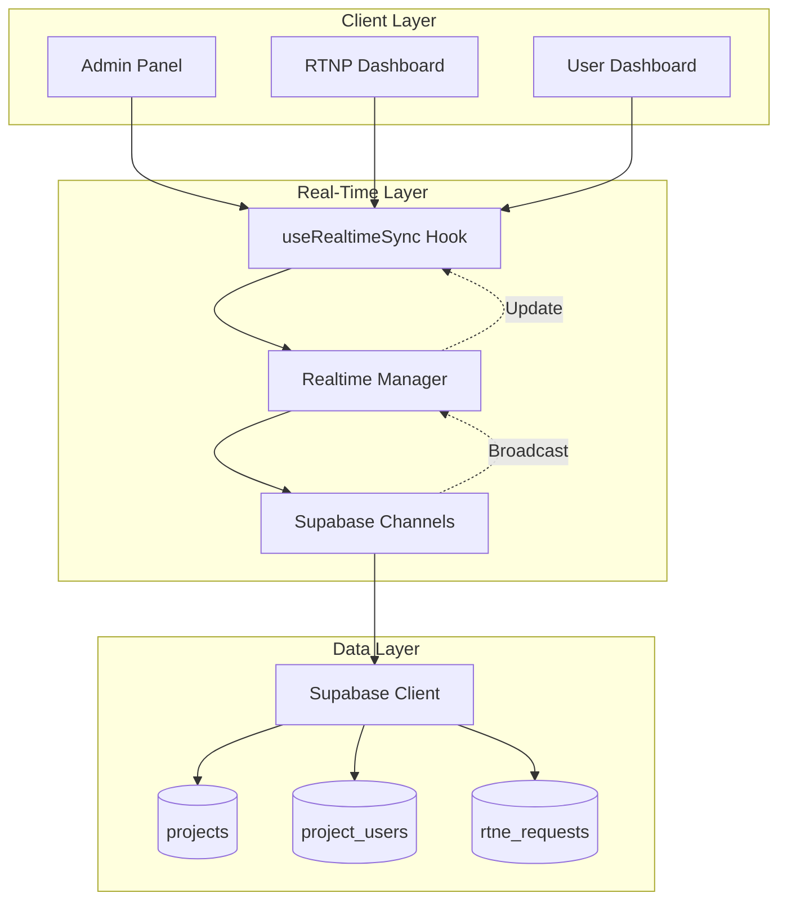
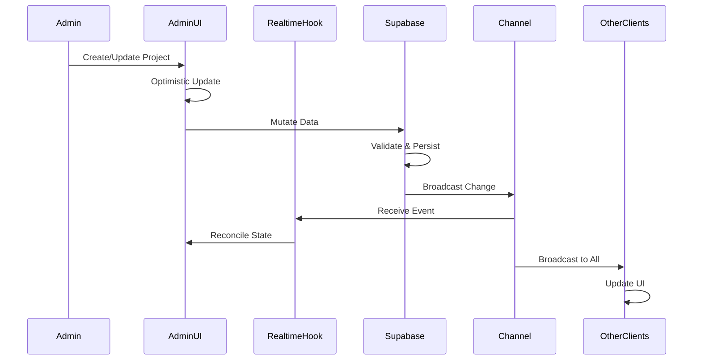

# Design Document: Real-Time Admin Project Management & LinkedIn URL Sync

## Overview

This design implements a comprehensive real-time collaboration system that enables administrators to manage projects and user assignments with instant synchronization across all connected clients. The system leverages Supabase Realtime to provide sub-second updates for project CRUD operations, user-project assignments, and LinkedIn URL changes without requiring page refreshes.

The architecture builds upon the existing RTNE (Real-Time Number Entry) system and extends it with admin capabilities while maintaining the current project-based structure (`projects`, `project_users`, `rtne_requests` tables).

### Key Design Principles

1. **Real-time First**: All data mutations broadcast immediately via Supabase Realtime channels
2. **Optimistic UI Updates**: Client-side updates occur immediately with server reconciliation
3. **Permission-Based Broadcasting**: Users only receive updates for data they can access
4. **Conflict Resolution**: Last-write-wins strategy with timestamp-based conflict detection
5. **Graceful Degradation**: System remains functional if real-time connection is lost

## Architecture

### High-Level Architecture



### Data Flow



## Components and Interfaces

### 1. Realtime Sync Hook (`useRealtimeSync`)

A custom React hook that manages real-time subscriptions and state synchronization.

```typescript
interface RealtimeSyncConfig<T> {
  table: string;
  filter?: string;
  event?: 'INSERT' | 'UPDATE' | 'DELETE' | '*';
  onInsert?: (payload: T) => void;
  onUpdate?: (payload: T) => void;
  onDelete?: (payload: { old: T }) => void;
  enabled?: boolean;
}

interface RealtimeSyncReturn<T> {
  data: T[];
  isConnected: boolean;
  error: Error | null;
  reconnect: () => void;
}

function useRealtimeSync<T>(config: RealtimeSyncConfig<T>): RealtimeSyncReturn<T>
```

**Responsibilities:**
- Establish and manage Supabase Realtime channel subscriptions
- Handle connection lifecycle (connect, disconnect, reconnect)
- Merge real-time updates with local state
- Provide connection status indicators
- Handle subscription cleanup on unmount

### 2. Project Management Service

Handles all project CRUD operations with real-time broadcasting.

```typescript
interface Project {
  id: string;
  name: string;
  owner_id: string;
  created_at: string;
  updated_at: string;
}

interface ProjectService {
  // CRUD Operations
  createProject(name: string, ownerId: string): Promise<Project>;
  updateProject(id: string, updates: Partial<Project>): Promise<Project>;
  deleteProject(id: string): Promise<void>;
  getProjects(): Promise<Project[]>;
  
  // Assignment Operations
  assignUserToProject(projectId: string, userId: string, role: string): Promise<void>;
  removeUserFromProject(projectId: string, userId: string): Promise<void>;
  updateUserRole(projectId: string, userId: string, role: string): Promise<void>;
  getProjectUsers(projectId: string): Promise<ProjectUser[]>;
}
```

### 3. LinkedIn URL Sync Service

Manages real-time synchronization of LinkedIn URLs in user sheets.

```typescript
interface LinkedInUrlUpdate {
  requestId: string;
  userId: string;
  linkedinUrl: string;
  timestamp: string;
}

interface LinkedInSyncService {
  updateLinkedInUrl(requestId: string, url: string): Promise<void>;
  subscribeToUrlUpdates(projectName: string, callback: (update: LinkedInUrlUpdate) => void): () => void;
  validateLinkedInUrl(url: string): boolean;
}
```

### 3a. Admin LinkedIn URL Management Service

Handles admin-specific operations for managing LinkedIn URL entries.

```typescript
interface LinkedInEntry {
  id: string;
  project_name: string;
  user_id: string;
  user_name: string;
  linkedin_url: string;
  full_name?: string;
  city?: string;
  job_title?: string;
  company_name?: string;
  email_address?: string;
  primary_phone?: string;
  phone_2?: string;
  phone_3?: string;
  phone_4?: string;
  status: string;
  created_at: string;
  updated_at: string;
}

interface AdminLinkedInService {
  // Delete operations
  deleteLinkedInEntry(entryId: string): Promise<void>;
  bulkDeleteLinkedInEntries(entryIds: string[]): Promise<void>;
  
  // Download/Export operations
  downloadLinkedInEntry(entryId: string, format: 'csv' | 'json'): Promise<Blob>;
  bulkDownloadLinkedInEntries(entryIds: string[], format: 'csv' | 'json'): Promise<Blob>;
  downloadAllLinkedInEntries(projectName?: string, format?: 'csv' | 'json'): Promise<Blob>;
  
  // Utility functions
  convertToCSV(entries: LinkedInEntry[]): string;
  convertToJSON(entries: LinkedInEntry[]): string;
  triggerDownload(blob: Blob, filename: string): void;
}
```

### 4. Admin Project Management UI

React components for admin project management interface.

```typescript
interface AdminProjectManagementProps {
  onProjectCreated?: (project: Project) => void;
  onProjectUpdated?: (project: Project) => void;
  onProjectDeleted?: (projectId: string) => void;
}

// Main admin component
function AdminProjectManagement(props: AdminProjectManagementProps): JSX.Element

// Sub-components
function ProjectList(): JSX.Element
function ProjectForm(): JSX.Element
function UserAssignmentManager({ projectId }: { projectId: string }): JSX.Element
```

### 4a. Admin LinkedIn URL Management UI

React components for admin LinkedIn URL management with delete and download capabilities.

```typescript
interface AdminLinkedInManagerProps {
  projectName?: string; // Optional filter by project
  onEntryDeleted?: (entryId: string) => void;
  onBulkDeleted?: (entryIds: string[]) => void;
  onDownloaded?: (format: 'csv' | 'json') => void;
}

// Main LinkedIn management component
function AdminLinkedInManager(props: AdminLinkedInManagerProps): JSX.Element

// Sub-components
function LinkedInEntryTable(): JSX.Element // Table with checkboxes for bulk selection
function LinkedInEntryRow({ entry, onDelete, onDownload, onSelect }: LinkedInEntryRowProps): JSX.Element
function BulkActionsToolbar({ selectedIds, onBulkDelete, onBulkDownload }: BulkActionsProps): JSX.Element
function DeleteConfirmDialog({ entryIds, onConfirm, onCancel }: DeleteConfirmProps): JSX.Element
function DownloadFormatSelector({ onSelect }: DownloadFormatProps): JSX.Element
```

### 5. RTNP Real-Time Dashboard Integration

Enhanced RTNP dashboard with real-time project and LinkedIn URL updates.

```typescript
interface RTNPDashboardEnhancement {
  // Subscribe to all project changes
  subscribeToProjects(): void;
  
  // Subscribe to LinkedIn URL updates for all users
  subscribeToLinkedInUpdates(): void;
  
  // Handle real-time user assignment changes
  handleUserAssignmentChange(change: ProjectUserChange): void;
}
```

### 6. User Dashboard Real-Time Integration

User dashboard that reflects project assignment changes in real-time.

```typescript
interface UserDashboardRealtime {
  // Subscribe to user's own project assignments
  subscribeToMyProjects(userId: string): void;
  
  // Handle assignment notifications
  handleAssignmentNotification(notification: AssignmentNotification): void;
}
```

## Data Models

### Extended Project Model

```typescript
interface Project {
  id: string;
  name: string;
  owner_id: string;
  created_at: string;
  updated_at: string;
  // Computed fields
  userCount?: number;
  requestCount?: number;
}
```

### Project User Assignment

```typescript
interface ProjectUser {
  id: string;
  project_id: string;
  user_id: string;
  role: 'owner' | 'manager' | 'member';
  created_at: string;
  updated_at: string;
  // Joined data
  user?: {
    id: string;
    email: string;
    full_name: string;
  };
  project?: Project;
}
```

### RTNE Request with Real-Time Support

```typescript
interface RTNERequest {
  id: string;
  project_name: string;
  user_id: string;
  user_name: string;
  linkedin_url: string;
  full_name?: string;
  city?: string;
  job_title?: string;
  company_name?: string;
  email_address?: string;
  primary_phone?: string;
  phone_2?: string;
  phone_3?: string;
  phone_4?: string;
  status: 'pending' | 'ready' | 'processing' | 'completed' | 'failed';
  row_number: number;
  created_at: string;
  updated_at: string;
  completed_at?: string;
  completed_by?: string;
}
```

### Real-Time Event Payloads

```typescript
interface RealtimePayload<T> {
  schema: string;
  table: string;
  commit_timestamp: string;
  eventType: 'INSERT' | 'UPDATE' | 'DELETE';
  new: T;
  old: T;
  errors: string[] | null;
}

interface ProjectChangeEvent {
  type: 'project_created' | 'project_updated' | 'project_deleted';
  project: Project;
  timestamp: string;
  userId: string;
}

interface AssignmentChangeEvent {
  type: 'user_assigned' | 'user_removed' | 'role_updated';
  projectId: string;
  userId: string;
  role?: string;
  timestamp: string;
  changedBy: string;
}

interface LinkedInUrlChangeEvent {
  type: 'linkedin_url_updated';
  requestId: string;
  userId: string;
  projectName: string;
  linkedinUrl: string;
  timestamp: string;
}
```

## Real-Time Channel Strategy

### Channel Organization

```typescript
// Channel naming convention
const CHANNELS = {
  // Global project changes (admins only)
  PROJECTS_ADMIN: 'realtime:projects:admin',
  
  // Project-specific changes (project members)
  PROJECT: (projectId: string) => `realtime:project:${projectId}`,
  
  // User-specific changes (individual users)
  USER: (userId: string) => `realtime:user:${userId}`,
  
  // RTNP dashboard (RTNP users)
  RTNP_DASHBOARD: 'realtime:rtnp:dashboard',
  
  // LinkedIn URL updates (project-scoped)
  LINKEDIN_URLS: (projectName: string) => `realtime:linkedin:${projectName}`,
};
```

### Subscription Management

```typescript
interface ChannelSubscription {
  channel: RealtimeChannel;
  table: string;
  filter?: string;
  callbacks: {
    onInsert?: (payload: any) => void;
    onUpdate?: (payload: any) => void;
    onDelete?: (payload: any) => void;
  };
}

class RealtimeManager {
  private subscriptions: Map<string, ChannelSubscription>;
  
  subscribe(config: ChannelSubscription): () => void;
  unsubscribe(channelName: string): void;
  unsubscribeAll(): void;
  getConnectionStatus(): 'connected' | 'disconnected' | 'reconnecting';
}
```

## Error Handling

### Connection Error Handling

```typescript
interface ConnectionError {
  type: 'connection_lost' | 'subscription_failed' | 'broadcast_failed';
  message: string;
  timestamp: string;
  retryable: boolean;
}

interface ErrorHandler {
  handleConnectionLost(): void;
  handleSubscriptionFailed(error: Error): void;
  handleBroadcastFailed(error: Error): void;
  scheduleReconnect(delay: number): void;
}
```

### Conflict Resolution

```typescript
interface ConflictResolution {
  strategy: 'last-write-wins' | 'optimistic-locking';
  
  // Last-write-wins: Compare timestamps
  resolveByTimestamp(local: any, remote: any): any;
  
  // Optimistic locking: Version-based
  resolveByVersion(local: any, remote: any): any;
  
  // Notify user of conflicts
  notifyConflict(conflict: DataConflict): void;
}

interface DataConflict {
  table: string;
  recordId: string;
  localValue: any;
  remoteValue: any;
  localTimestamp: string;
  remoteTimestamp: string;
}
```

### Graceful Degradation

```typescript
interface DegradationStrategy {
  // Fallback to polling when real-time fails
  enablePolling(interval: number): void;
  disablePolling(): void;
  
  // Queue mutations when offline
  queueMutation(mutation: PendingMutation): void;
  flushQueue(): Promise<void>;
  
  // Show connection status
  showConnectionStatus(status: ConnectionStatus): void;
}

interface PendingMutation {
  id: string;
  table: string;
  operation: 'insert' | 'update' | 'delete';
  data: any;
  timestamp: string;
  retryCount: number;
}
```

## Testing Strategy

### Unit Tests

1. **Realtime Hook Tests**
   - Test subscription lifecycle
   - Test event handling (insert, update, delete)
   - Test reconnection logic
   - Test cleanup on unmount

2. **Service Layer Tests**
   - Test project CRUD operations
   - Test user assignment operations
   - Test LinkedIn URL updates
   - Test error handling

3. **Conflict Resolution Tests**
   - Test timestamp-based resolution
   - Test concurrent update scenarios
   - Test conflict notification

### Integration Tests

1. **Real-Time Sync Tests**
   - Test end-to-end project creation and broadcast
   - Test user assignment changes across clients
   - Test LinkedIn URL updates visibility
   - Test permission-based filtering

2. **Multi-Client Tests**
   - Test simultaneous updates from multiple admins
   - Test broadcast to correct user groups
   - Test connection recovery

3. **Performance Tests**
   - Test with 100+ concurrent connections
   - Test broadcast latency
   - Test message queue under load

### E2E Tests

1. **Admin Workflow**
   - Create project → Verify all clients see it
   - Assign user → Verify user dashboard updates
   - Delete project → Verify cleanup across clients

2. **User Workflow**
   - Paste LinkedIn URL → Verify RTNP sees it instantly
   - Receive assignment → Verify dashboard updates
   - Update profile → Verify admin sees changes

3. **RTNP Workflow**
   - View all projects → Verify real-time updates
   - See LinkedIn URLs → Verify instant visibility
   - Complete requests → Verify user notifications

## Security Considerations

### Row-Level Security (RLS) Policies

```sql
-- Projects: Admins and project members can read
CREATE POLICY "realtime_projects_select"
ON projects FOR SELECT
USING (
  get_current_user_role() = 'admin'
  OR EXISTS (
    SELECT 1 FROM project_users
    WHERE project_id = projects.id
    AND user_id = auth.uid()
  )
);

-- Project Users: Admins and project owners can manage
CREATE POLICY "realtime_project_users_manage"
ON project_users FOR ALL
USING (
  get_current_user_role() = 'admin'
  OR EXISTS (
    SELECT 1 FROM projects
    WHERE id = project_users.project_id
    AND owner_id = auth.uid()
  )
);

-- RTNE Requests: Users see own, RTNP/admins see all
CREATE POLICY "realtime_rtne_requests_select"
ON rtne_requests FOR SELECT
USING (
  user_id = auth.uid()
  OR auth.email() = 'realtimenumberprovider@amplior.com'
  OR get_current_user_role() = 'admin'
);
```

### Channel Access Control

```typescript
interface ChannelAccessControl {
  // Verify user can subscribe to channel
  canSubscribe(userId: string, channelName: string): boolean;
  
  // Filter events based on permissions
  filterEvent(event: RealtimePayload<any>, userId: string): boolean;
  
  // Validate broadcast permissions
  canBroadcast(userId: string, table: string, operation: string): boolean;
}
```

## Performance Optimization

### Connection Pooling

```typescript
interface ConnectionPool {
  // Reuse channels when possible
  getOrCreateChannel(name: string): RealtimeChannel;
  
  // Batch subscriptions
  batchSubscribe(subscriptions: ChannelSubscription[]): void;
  
  // Clean up idle channels
  pruneIdleChannels(idleTimeout: number): void;
}
```

### Message Batching

```typescript
interface MessageBatcher {
  // Batch multiple updates into single broadcast
  batchUpdates(updates: any[], maxBatchSize: number): void;
  
  // Debounce rapid updates
  debounceUpdate(key: string, update: any, delay: number): void;
  
  // Throttle high-frequency events
  throttleEvent(eventType: string, maxRate: number): void;
}
```

### State Management

```typescript
interface OptimizedStateManager {
  // Use React Query for caching
  useProjectsQuery(): UseQueryResult<Project[]>;
  
  // Optimistic updates
  optimisticUpdate(mutation: Mutation): void;
  
  // Invalidate and refetch on conflicts
  invalidateAndRefetch(queryKey: string[]): void;
}
```

## Migration Strategy

### Phase 1: Infrastructure Setup
- Implement `useRealtimeSync` hook
- Create `RealtimeManager` service
- Add connection status indicators

### Phase 2: Project Management
- Implement admin project CRUD with real-time
- Add project assignment management
- Test multi-admin scenarios

### Phase 3: LinkedIn URL Sync
- Enhance RTNE page with real-time subscriptions
- Update RTNP dashboard for instant URL visibility
- Test cross-user synchronization

### Phase 4: User Dashboard Integration
- Add real-time assignment notifications
- Update user dashboard with live project list
- Implement graceful degradation

### Phase 5: Performance & Polish
- Optimize channel subscriptions
- Add message batching
- Implement comprehensive error handling
- Performance testing and tuning

## Monitoring and Observability

### Metrics to Track

```typescript
interface RealtimeMetrics {
  // Connection metrics
  activeConnections: number;
  connectionErrors: number;
  reconnectionAttempts: number;
  
  // Message metrics
  messagesReceived: number;
  messagesSent: number;
  messageLatency: number; // milliseconds
  
  // Performance metrics
  subscriptionCount: number;
  channelCount: number;
  memoryUsage: number;
}
```

### Logging Strategy

```typescript
interface RealtimeLogger {
  logConnection(event: 'connected' | 'disconnected' | 'error', details: any): void;
  logSubscription(channelName: string, event: 'subscribed' | 'unsubscribed'): void;
  logMessage(direction: 'sent' | 'received', payload: any): void;
  logError(error: Error, context: any): void;
}
```

## Dependencies

- **@supabase/supabase-js** (^2.49.4): Core Supabase client with Realtime support
- **@tanstack/react-query** (^5.56.2): State management and caching
- **react** (^18.3.1): UI framework
- **zod** (^3.23.8): Runtime validation for real-time payloads

## Conclusion

This design provides a comprehensive real-time collaboration system that enables instant synchronization of project management operations and LinkedIn URL updates across all connected clients. By leveraging Supabase Realtime channels, optimistic UI updates, and permission-based broadcasting, the system delivers a seamless collaborative experience while maintaining data consistency and security.
